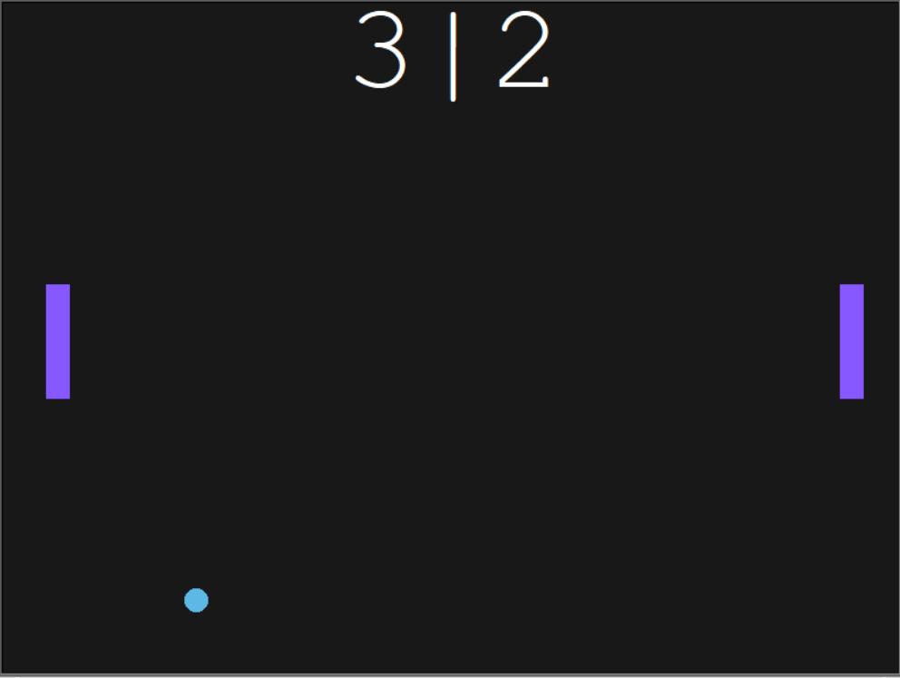

# Contains
This folder contains the code and executable file of 'pong game' created on Day 22 of 100 days of code

## Code
1. **main.py** this file contains the main code of the program
2. **paddle.py** this file contains code of the Paddle class used to created the left and right paddle of the game
3. **ball.py** this file contains code of the Ball class used to create the ball of the game
4. **scoreboard.py** this file contains code of Scoreboard class that is used to display the scoreboard at the top center of the screen

## Executable
You can play the game by just running the .exe file of the game.

## How to play
It's very simple, left paddle is controlled using 'w' and 's' keys on the keyboard and right paddle is controlled using up and down arrow keys on the keyboard

## Screenshot

