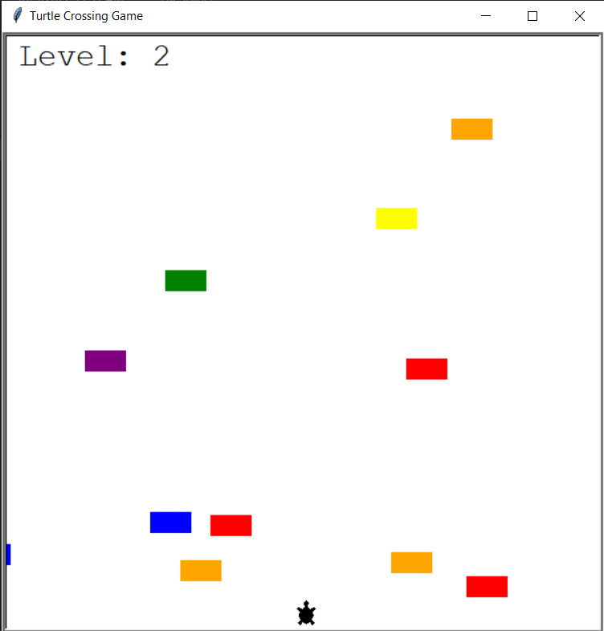

# Contains
This day 23 contains the code for turtle crossing game, the goal is simple, the turtle has to cross the field without getting hit by any car (rectangles), the player can use Up/Down arrow keys or w/s keys to move the turlte forward and backward. One the turtle crosses the field, the game is preceeded to the next level and the speed of all cars increases

## Code
1. **main.py** contains the main code of the program
2. **player.py** contains code of Player class
3. **car_manager.py** contains code of Car class and CarManager class
4. **scoreboard.py** contains code of Scoreboard class

## Executable
the game can be played by running **turtle_cross.exe** file

## Screenshot
