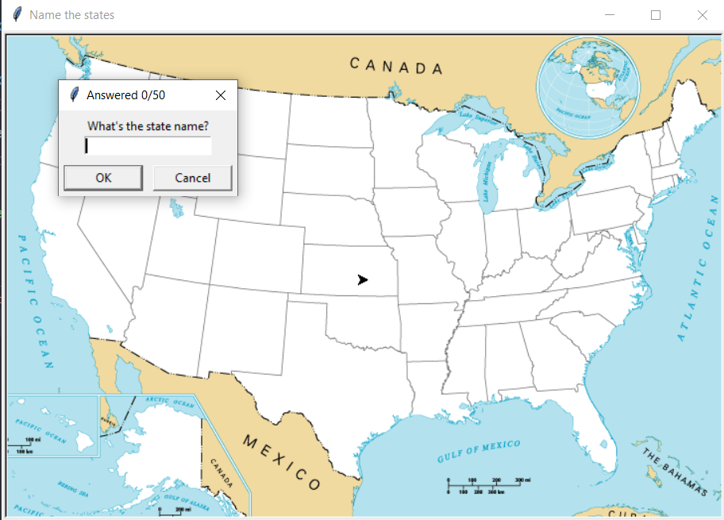
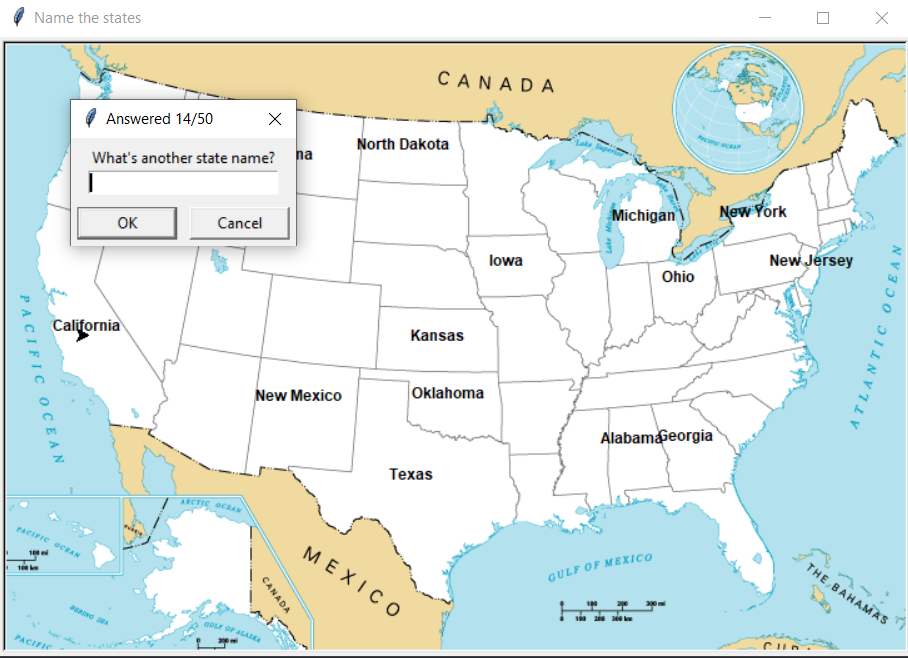

# Contains
This day 25 contains name the US states game

When the game starts, the user is presented with an empty map of United States
The user has to type state names, as the user enter each name, the map is filled the state names.

In order to win the game, the user has to name all states (there are 50 US states in total)

## Screenshot 1
This is how the initial screen looks like

## Screenshot 2
After some questions are answered
